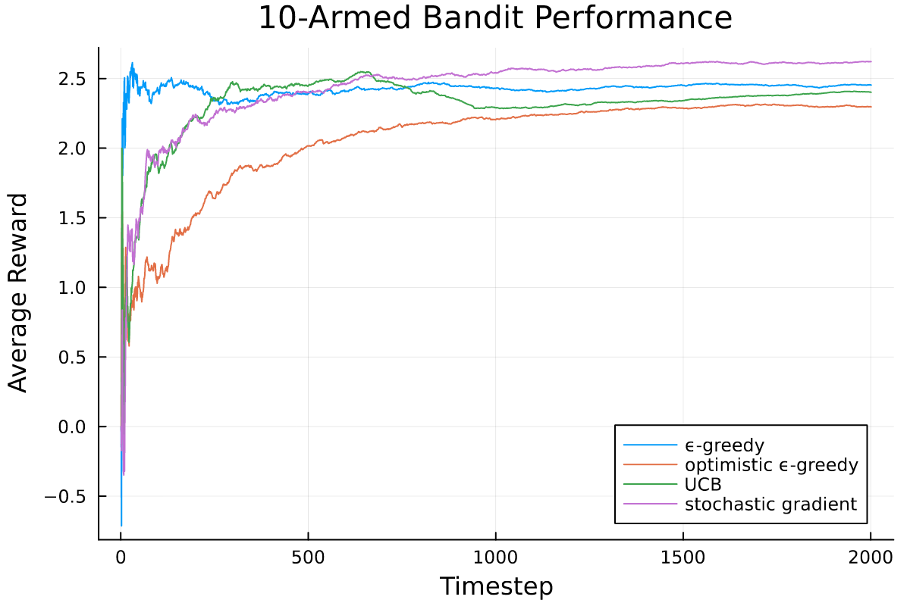
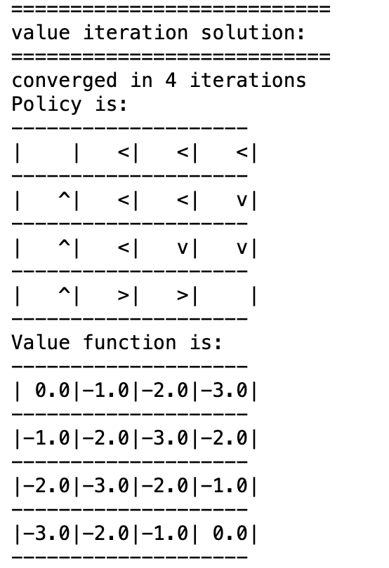
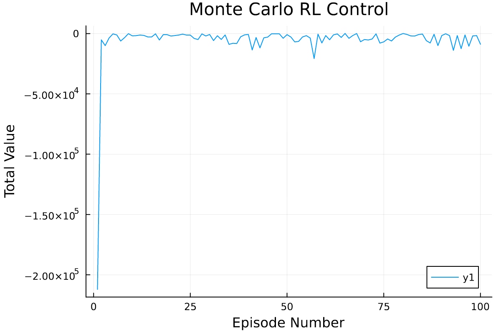
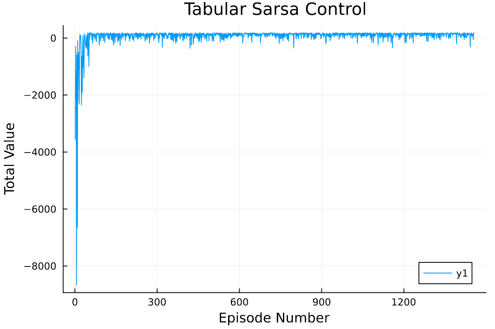
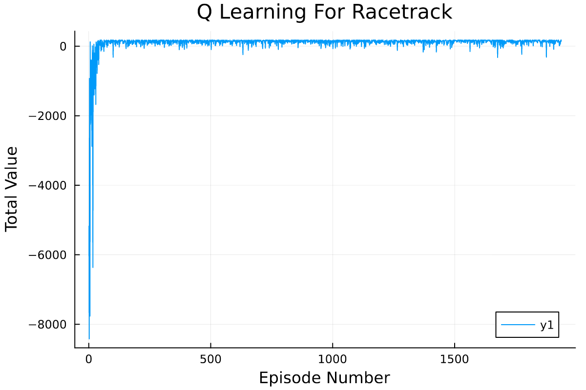
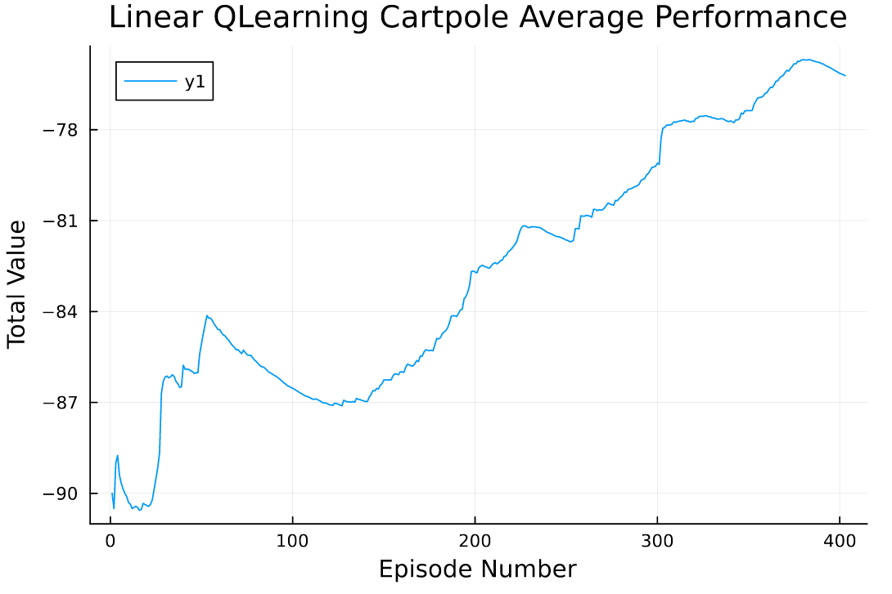

# Yatalam
verb - gain or acquire knowledge of or skill in (something) by study, experience, or being taught.

This repository is a set of generic Julia implementations of the more "classical" reinforcement learning techniques described in Reinforcement Learning: An Introduction by Sutton and Barto. Dynamic programming methods, tabular learning methods (both on policy and off policy) and learning methods that use linear estimators are implemented. Also, a tile coding feature selector is implemented for use with the linear methods.

There is also some code to simulate environments. The Cartpole environment works by linking with OpenAI gym, while racetrack and gridworld were hand implemented based on the descriptions in the textbook.
 
Jupyter Notebooks are included that graph results from these agents running on these environments. Unfortunately the Github frontend does not properly render Julia plots, so I have included some interesting figures below:

## k-Armed Bandits

## Gridworld

## Racetrack

## Cartpole

